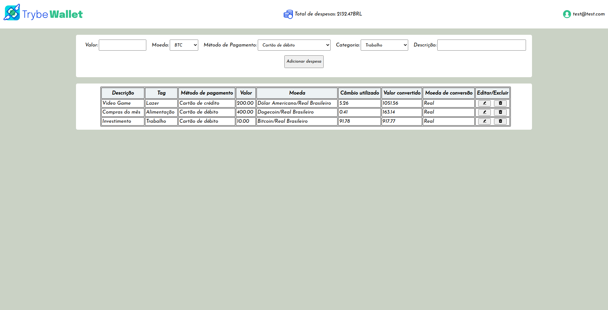

# Seja bem-vindo ao projeto Trybewallet!!💸📈

#### Essse projeto tem como objetivo propor uma carteira de controle de gastos com conversor de moedas, onde o usuário pode montar suas despesas com as expecifícações desejadas. Com esse projeto tive meu primeiro contato com <a href="https://redux.js.org/">Redux</a> e suas funcionalidades que servem para o gerenciamento de estado global de aplicações.

  

## Tecnologias :

<ul>
  <li>HTML</li>
  <li>CSS</li>
  <li>Java Script</li>
  <li>React</li>
  <li>Redux</li>
  <li>Jest</li>
  <li>React Testing Library</li>
</ul>

## Funcionalidades:

- Possível logar com um e-mail valido com '@' e '.' (Ex: `string@string.string`) e senha com mais de 5 caracteres.
- Possível observar despesas totais.
- Possível escolher valor da despesa, método de pagamento, categoria e descrição.
- Possível escolher 1 moeda entre 15 opções para conversão em BRL.
- Possível editar e excluir uma despesa por vez.

## Como executar:

- Clone em seu computador (via SHH).
- Abra um novo terminal em seu VSCode.   
- Execute o comando para instalar dependências: `npm install`.
- Para incializar execute o comando: `npm start`.

## Também disponível em:

### <a href="https://trybewallet-gold.vercel.app/" ><b>Trybewallet</b></a>

## Como contribuir no projeto:
  1. Faça um **fork** do projeto;
  2. Crie uma nova branch com as suas alterações: `git checkout -b my-feature`;
  3. Salve as alterações e crie uma mensagem de commit contando o que você fez: `git commit -m "feature: My new feature"`;
  4. Envie as suas alterações: `git push origin my-feature`;
  5. Abra o seu pull-request na página do GitHub.  

## Licença:

 Esse projeto está sob a licença: 

 

 ##  Autor:

### <a href="https://www.linkedin.com/in/jorge-reis-dev/" ><b>Jorge Wellington.</b></a>
